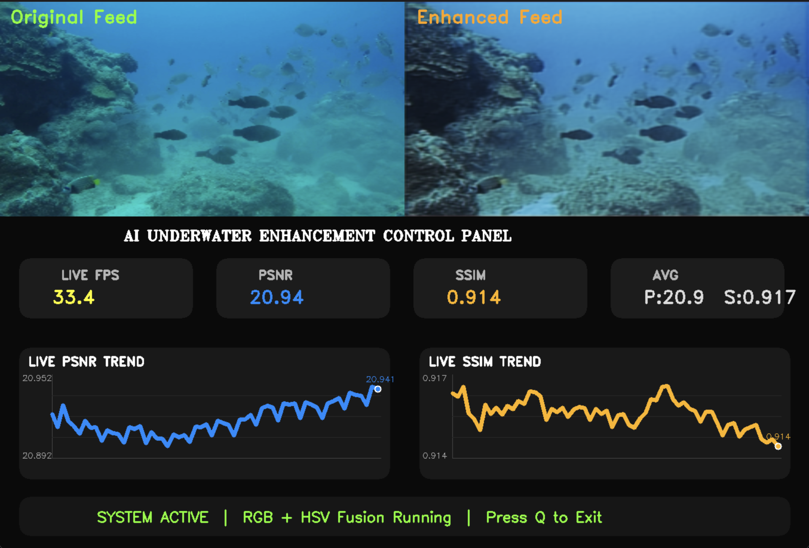

# AI Underwater Image Enhancement

An AI-based system for enhancing underwater images and videos affected by poor visibility, color distortion, haze, and low contrast.

## Features

- Underwater image enhancement
- RGB + HSV fusion
- Real-time video enhancement
- PSNR and SSIM evaluation
- Live FPS monitoring
- PSNR and SSIM trend graphs
- YOLO-based object detection
- Real-time performance dashboard

## Technologies

Python • OpenCV • PyTorch • NumPy • YOLO • Matplotlib • Scikit-Image

## Dataset

The project uses paired underwater images organized into:

dataset/input/  
dataset/target/

## Evaluation

**PSNR** – image reconstruction quality  
**SSIM** – structural similarity  
**FPS** – real-time processing speed

## Project Goal

The main goal of this project is to develop an AI-assisted underwater image enhancement system that improves the visibility and visual quality of underwater images and videos affected by poor lighting, color distortion, haze, and low contrast.
The system combines RGB and HSV-based image processing with deep learning techniques to produce clearer enhanced images while maintaining real-time performance. The enhancement results are evaluated using PSNR and SSIM, while FPS is monitored to measure real-time processing efficiency.
The project also integrates YOLO-based object detection and a real-time performance dashboard, making the system suitable for potential applications in underwater exploration, marine research, surveillance, and underwater robotics.

## License

For academic and educational purposes.

## Dashboard

